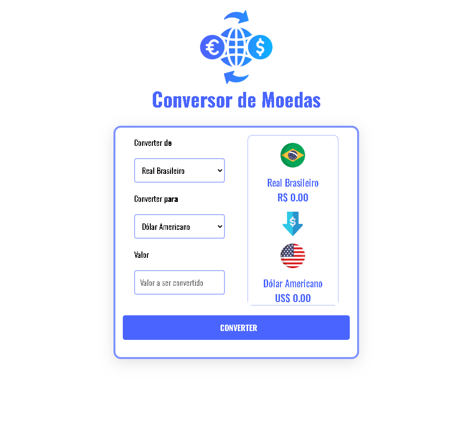

# 💱 Conversor de Moedas - DevClub

Este é um projeto desenvolvido durante o módulo de **JavaScript Web** do curso DevClub. O objetivo foi criar uma aplicação funcional capaz de converter valores entre diferentes moedas (Real, Dólar, Euro, etc.) em tempo real ou com taxas fixas.

## 🚀 Funcionalidades

- [x] Seleção da moeda de origem e destino.
- [x] Input para inserção do valor a ser convertido.
- [x] Conversão automática ao clicar no botão "Converter".
- [x] Formatação de moeda (ex: R$ 1.000,00).
- [x] Design responsivo.

## 🛠️ Tecnologias Utilizadas

- **HTML5**: Estruturação da página.
- **CSS3**: Estilização e layout responsivo.
- **JavaScript (ES6+)**: Lógica de conversão e manipulação do DOM.

## 🖥️ Como rodar o projeto

1.  Clone este repositório:
    ```bash
    git clone [https://github.com/Kojiuedadev/DevClub.git](https://github.com/Kojiuedadev/DevClub.git)
    ```
2.  Navegue até a pasta do projeto:
    ```bash
    cd "02-javascript/JavaScript/conversor_de_moedas"
    ```
3.  Abra o arquivo `index.html` no seu navegador.

## 📷 Pré-visualização



## 🤝 Contribuições

Este projeto foi realizado para fins de estudo. Sugestões são bem-vindas!

---
Desenvolvido por **Kojiuedadev** 🚀